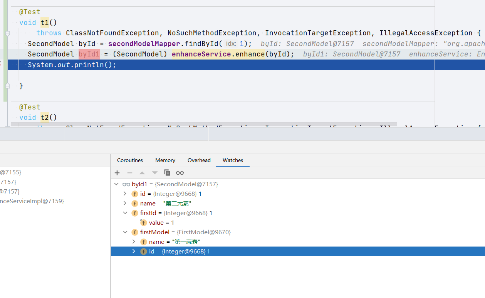
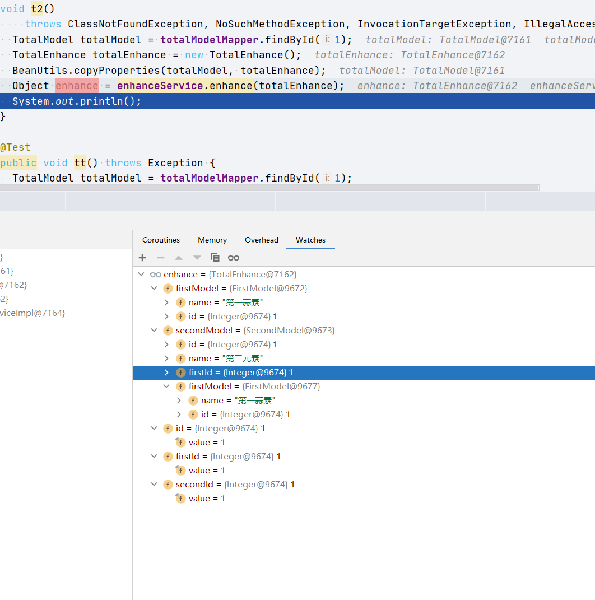

# 增强 byId 查询
- 关系表中使用id作为外键进行绑定. 有时候查询一个实体对象需要在sql中连接很多层 left join. 为了少些一些. 有这样一个想法: 是否可以通过一些注解和一个公用方法直接返回. 


- 先做几个表作为测试用.

- `first_model` 

  | id   | name     |
  | ---- | -------- |
  | 1    | 第一蒜素 |

- `second_model`

  | id   | name     | first_id |
  | ---- | -------- | -------- |
  | 1    | 第二元素 | 1        |

- `total_model`

  | id   | first_id | id   |
  | ---- | -------- | ---- |
  | 1    | 1        | 1    |

  


- 实体对象

  ```java
  public class FirstModel {
  
    private String name;
    private Integer id;
  }
  
  public class SecondModel {
  
    private Integer id;
    private String name;
    private Integer firstId;
  }
  
  public class TotalModel {
  
    private Integer id;
    private Integer firstId;
    private Integer secondId;
  }
  ```


- 上述对象是基本的实体对象. 比如查询`second_model` `id=1` 想要获取`first_model`的数据需要做一个`left join` 然后组装出一个新的对象. 或者使用 **one to more ** 或者 **one to one**  等其他的关系标签，配置上相对麻烦.


先来做第一个尝试 将 second_mode 的查询. 编写如下代码

```java
public class SecondModel {

  private Integer id;
  private String name;
  private Integer firstId;
  private FirstModel firstModel;
}
```

- 希望是将 FirstModel 填充到字段中.


- 开发思想

  1. 这个表里面需要有一个可以查询外联对象的主键. (外键)
  2. 需要有一个查询方法. 通过外键可以查询.
  3. 需要有一个指定的mapper

- 在这些元素绑定后可以定义出一个注解.

  ```java
  @Documented
  @Inherited
  @Retention(RetentionPolicy.RUNTIME)
  @Target({ElementType.FIELD})
  public @interface ByIdEnhance {
  
    /**
     * 外键
     *
     * @return 外键字段名称
     */
    String foreignKey();
  
    /**
     * 查询函数,在mapper上. 如果不填则使用selectById
     *
     * @return 查询实体的函数
     */
    String queryMethod() default "";
  
    /**
     * mapper
     * @return mapper class
     */
    Class<?> mapper();
  
    /**
     * 外键类型
     * @return 外键类型
     */
    Class<?> idType() default Integer.class;
  }
  ```


- 在思想确定后接下来就是解析. 
  1. 找到注解
  2. 找到mapper
  3. 执行方法
  4. 对有注解的字段赋值

- 赋值结果如下



- 这是一个一层对象的赋值. 如果出现多层的对象赋值如何处理? 通过递归的方式进行处理.


- 定义一个total_model 的拓展对象


```java
public class TotalEnhance extends TotalModel {

  @ByIdEnhance(foreignKey = "firstId", mapper = FirstModelMapper.class, queryMethod = "selectById")
  private FirstModel firstModel;

  @ByIdEnhance(foreignKey = "secondId", mapper = SecondModelMapper.class, queryMethod = "findById")
  private SecondModel secondModel;
}
```





- 源码地址: https://github.com/huifer/crud.git 